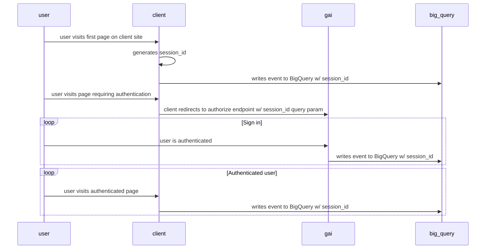

# Analytics

Get an identity writes web request events to Big Query in a format compatible with [DfE Analytics](https://github.com/DFE-Digital/dfe-analytics).

To enable cross-service analytics, some kind of session identifier is required that is written to analytics events for both the calling service and
Get an identity itself. With this in place, queries can be written that span multiple BigQuery datasets and this identifier can be used to correlate the
events for a given user.

To pass this session identifier to Get an identity, a `session_id` query parameter can be appended to the `authorize` endpoint.
The analytics events for all subsequent page visits in the authorization journey will have a `session_id` entry added to the `data` field with the value from
the query parameter.

