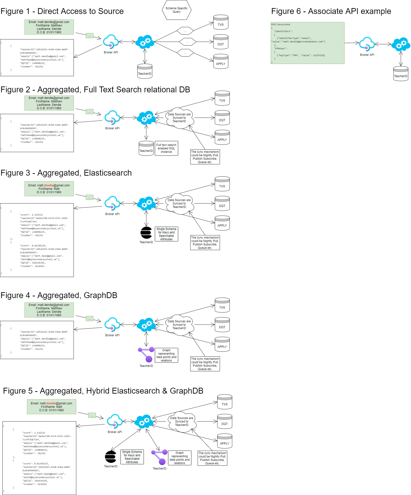

# Teacher Identity - Broker API Data Retrieval / Storage Tech choices

When focussing on the Broker API in Teacher Identity, there are a number of choices to be made around the 
potential solutions to the data problem.  The data is stored in a variety of places, using a variety of storage technologies.
Some data is stored in a CRM, whilst other data is store in anther services private data store.  

The Broker API will need access to _the data_ stored in one or more of these data stores if it hopes to be able to harness all the available data for a 'Person in education'.  Either the data stays in its original place, and is accessed from there (Provided performance and capability contraints allow this), or the data will be aggregated into a separate data store/stores, specifically designed for the Broker API; In which case, keeping the data synchronised between these places is another concern.

In the case that a separate, aggregated data store is preferred, there are a number of options available that could lend greater capabilities for consumers of the Broker API.  For example, a search service like elasticsearch could perform enhanced fuzzy matching to return results based on a level of confidence (score), whilst a graphDb could maintain an accurate graph of how records and attributes are related amoungst the datasets that are being aggregated.

A summary of data access/storage options is illustrated below

## Figure 1 - Direct Access to Source
In this scenario, the data from each service/system is not moved from its original storage location.  Rather, each data source is queried in an on-demand basis, using the appropriate mechanism for the technoglogy.  In order to speed up retrieval and to build relational links between sources, key data returned in the query is stored in a local data store so that the service can build a picture of a person.

## Figure 2 - Aggregated, Full Text Search relational DB
This scenario copies data from the data sources, and stores the data in a relational database with a suitable schema.  The data is kept synchronised by means which are out of scope for this document.  Full Text Search features on the data store mean that we can employ basic fuzzy search functionality, without placing load on source systems.

## Figure 3 - Aggregated, Elasticsearch
This scenario copies data from the data sources, and stores the data in an Elasticsearch search system.  The data is kept synchronised by means which are out of scope for this document. The search service allows us to finely tune advanced fuzzy matching and search techniques - allowing us greater record recall with partially incorrect search terms.  With greater recall, the precision of the results might decrease - results will have a 'score', allowing Broker API consumers to disambiguate - perhaps by asking further questions based on possible matches.

## Figure 4 - Aggregated, GraphDB
This scenario copies data from the data sources, and stores the data in a GraphDB.  The data is kept synchronised by means which are out of scope for this document. The graphDb allows us to understand the conenctions between datasets in a much more rational way, and can be effectivley used to spot duplicate records across many datasets.  Neo4j (a graphDB with deployments in DfE) also allows for a basic level fuzzy matching.

## Figure 5 - Aggregated, Hybrid Elasticsearch & GraphDB
This scenario is a hybrid of ther Search and GraphDB options detailed above.  With the fast and powerful search capabilities of elasticsearch, and the graph capabilities of Neo4j, the scenario allows the greatest of capabilities in terms of search and relating data between datasets.

## Figure 6 - Associate API example
This figure is a basic example of a call a consumer might make to share data with the Broker API.  The consumer, in this case, as learned that a user has a TRN and is updating the broker to let it know that the user's email address is associated to the supplied TRN.  This data can then be shared with other services that are looking to learn more about users, including accessing their TRN.
