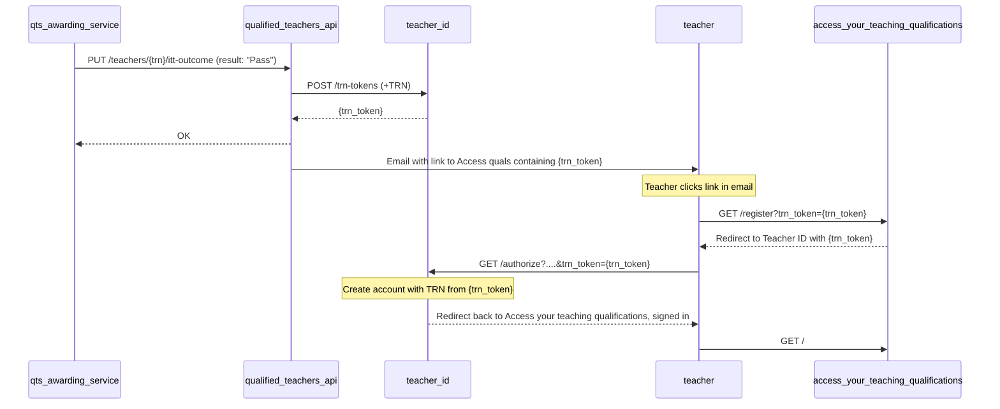

# Register via a magic link

When users are awarded QTS we would like them to have a Teacher ID Account to associate their TRN with.

Until upstream services are fully integrated with ID (Apply for QTS, Register etc.) and can pass the Qualified Teachers
API a Teacher ID at the point of awarding QTS, we will instead send an email to the teacher and invite them to create
a Teacher ID account. The email will include a 'magic link' that prompts the user to register (or sign in) and will
automatically associate the account they create with their TRN. This will remove the need to ask the teacher questions
to find them on DQT. After registration has been completed, they will be redirected to the Access your teaching
qualifications service where they can download their QTS certificate.

## How it works

1. QTS-awarding services (e.g. Register) call the `/v2/teachers/{trn}/itt-outcome` endpoint on the Qualified Teachers API with a 'Pass' result.
1. After updating DQT, this endpoint will call a new endpoint on Teacher ID: `POST /trn-tokens` passing along the TRN. 
1. Teacher ID will create a new random token and store it, the TRN and an expiry date in its DB, and return the token.
1. The Qualified Teachers API then emails the teacher (using the email address in DQT) with a link to the Access your teaching qualifications service that includes the TRN token obtained above as a query parameter.
1. The teacher clicks the link in the email and they are directed to Access your teaching qualifications. This redirects the user to Teacher ID to sign in, passing along the TRN token query parameter.
1. Teacher ID prompts the user to register, captures the minimal required information (mobile number etc.) and creates an account that's associated with the TRN in the TRN token query parameter.
1. Teacher is signed in and redirected back to Access your teaching qualifications.

