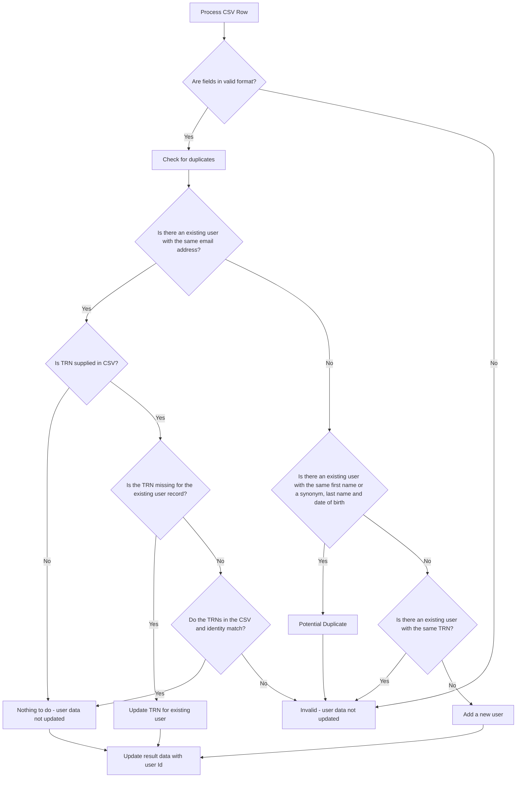

# Importing users into identity

## Overview

As more and more DfE services migrate to using `Identity` to manage authentication and authorisation, there is the need to migrate existing users of these services into identity.  
While this could be done the next time the user interacts with the specific service, it would mean them having to re-enter their details in order to create a teaching account.  
The user import feature has been created to automate the creation of teaching accounts in identity from users of other services as much as possible.

## Import File Definition

The user import requires a CSV file with a header with the following fields:

| Header Name   | Description                                                  | Expected Format                                    |
| ------------- | ------------------------------------------------------------ | -------------------------------------------------- |
| ID            | The unique ID associated with the user in the source service | A string up to 100 characters                      |
| EMAIL_ADDRESS | The user's email address                                     | A valid email address format up to 200 characters* |
| FIRST_NAME    | The user's first name                                        | A string up to 200 characters                      |
| LAST_NAME     | The user's last name                                         | A string up to 200 characters                      |
| DATE_OF_BIRTH | The user's date of birth                                     | A valid date in ddMMyyyy format e.g. 03051971      |
| TRN           | The user's TRN (if known in the source service)              | Empty or a 7 digit number                          |

\* Note that there is no validation of whether it is actually a valid personal email

## Download File Definition

The results of each file import can be downloaded in a CSV file with the following fields:

| Header Name         | Description                                                  | Format                                         |
| ------------------- | ------------------------------------------------------------ | -----------------------------------------------|
| RowNumber           | The row number from the original uploaded CSV file           | An integer                                     |
| Id                  | The unique ID associated with the user in the source service | A string                                       |
| UserId              | The unique ID associated with the user in identity           | A GUID                                         |
| UserImportRowResult | The outcome associated with the row of data from the CSV     | One of None, UserAdded, UserUpdated or Invalid |
| Notes               | Any notes e.g. errors                                        | A string with multiple notes separated by ". " |
| RawData             | The raw row of data from the original uploaded CSV file      | A string                                       |

## Additional Rules

The following diagram shows the process for each row of data in the CSV file

