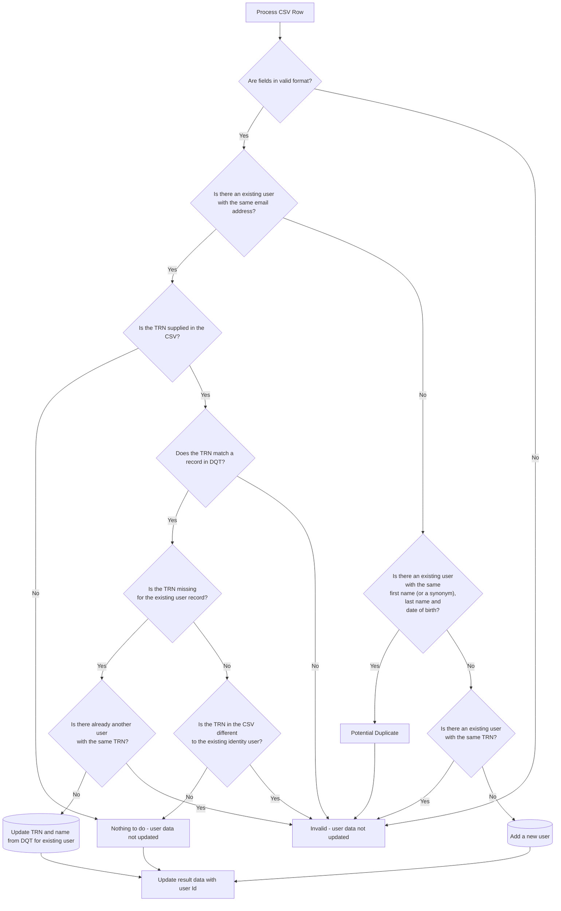

# Importing users into identity

## Overview

As more and more DfE services migrate to using `Identity` to manage authentication and authorisation, there is the need to migrate existing users of these services into identity.  
While this could be done the next time the user interacts with the specific service, it would mean them having to re-enter their details in order to create a teaching account.  
The user import feature has been created to automate the creation of teaching accounts in identity from users of other DfE services as much as possible.

## Import File Definition

The user import requires a CSV file with a header with the following fields:

| Header Name    | Description                                                  | Mandatory? | Expected Format                                       |
| -------------- | ------------------------------------------------------------ | -----------| ----------------------------------------------------- |
| ID             | The unique ID associated with the user in the source service | Mandatory  | A string of up to 100 characters                      |
| EMAIL_ADDRESS  | The user's email address                                     | Mandatory  | A valid email address format of up to 200 characters* |
| TRN            | The user's TRN (if known in the source service)              | Optional   | Empty or a 7 digit number                             |
| FIRST_NAME     | The user's first name                                        | Optional   | Mandatory string of up to 200 characters if TRN is empty   otherwise must be empty |
| MIDDLE_NAME    | The user's middle name                                       | Optional   | Empty or a string of up to 200 characters if TRN is empty   otherwise must be empty |
| LAST_NAME      | The user's last name                                         | Optional   | Mandatory string of up to 200 characters if TRN is empty   otherwise must be empty |
| PREFERRED_NAME | The user's preferred name                                    | Optional   | Empty or a string of up to 200 characters             |
| DATE_OF_BIRTH  | The user's date of birth                                     | Mandatory  | A valid date in ddMMyyyy format e.g. 03051971         |

\* Note that there is no validation of whether the email address supplied is actually a valid personal email

## Download File Definition

The results of each file import can be downloaded in a CSV file with the following fields:

| Header Name                 | Description                                                  | Format                                                 |
| --------------------------- | ------------------------------------------------------------ | ------------------------------------------------------ |
| ROW_NUMBER                  | The row number from the original uploaded CSV file           | An integer                                             |
| ID                          | The unique ID associated with the user in the source service | A string                                               |
| USER_ID                     | The unique ID associated with the user in identity           | A GUID                                                 |
| USER_USER_IMPORT_ROW_RESULT | The outcome associated with the row of data from the CSV     | One of `None`, `UserAdded`, `UserUpdated` or `Invalid` |
| NOTES                       | Any notes e.g. errors                                        | A string with multiple notes separated by ". "         |
| RAW_DATA                    | The raw row of data from the original uploaded CSV file      | A string                                               |

This CSV can then be used by the source service to enhance its data with user IDs from Identity i.e. specifically all rows except those marked `Invalid`.

## Summary of Notes

Following is a summary of potential notes/messages which may be included in the download file and any further action which might be necessary.

| Note                                                                       | Explanation | Action |
| -------------------------------------------------------------------------- | ----------- | ------------------------------------------------------------------------------------------------------------------ |
| Potential duplicate user                                                   | There is an existing record in identity with the same first name (or synonym), last name and date of birth but a different email address to the one supplied in the import file. | Manual review of records in source system (e.g. NPQ) and identity. |
| A user already exists with the specified email address but a different TRN | There is an existing record in identity with the same email address and TRN as the one supplied in the import file. | No action necessary - the export file will contain the associated User ID from identity. |
| A user already exists with the specified TRN | There is an existing record in identity with the same TRN but a different email address to the one supplied in the import file. | Manual review of records in source system (e.g. NPQ), identity & DQT to check if the user is the same person. Could potentially copy the User ID from identity if happy that they are the same person. |
| Updated TRN and name for existing user | There is an existing record in identity which matches the email address in the import file but doesn't have a TRN. The TRN is updated for the identity user along with the first, middle and last names from the associated record in DQT. | No action necessary - the export file will contain the associated User ID from identity. |
| TRN field must match a record in DQT | No record could be found in DQT which matches the TRN supplied in the import file. | Manual review of records in source system (e.g. NPQ) & DQT to see what the problem might be (e.g. could they potentialy be inactive?). |
| DATE_OF_BIRTH field should be a valid date in ddMMyyyy format | This is most likely because of using a "null" date in Excel which exports to CSV as 00011900 i.e. an invalid date. | Currently DATE_OF_BIRTH is mandatory in the user import so these records will not get imported. |
| A user already exists with the specified email address but a different TRN | There is an existing record in identity with the same email address but a different TRN to the one supplied in the import file. | Manual review of records in source system (e.g. NPQ), identity & DQT to check if the user is the same person. Could potentially copy the User ID from identity if happy that they are the same person. |

## User Import Processing

The following diagram shows how each row in the CSV file is processed and the possible outcomes:

